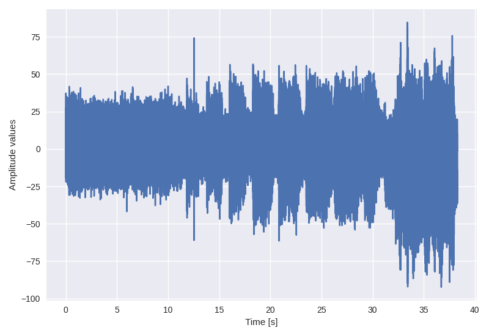
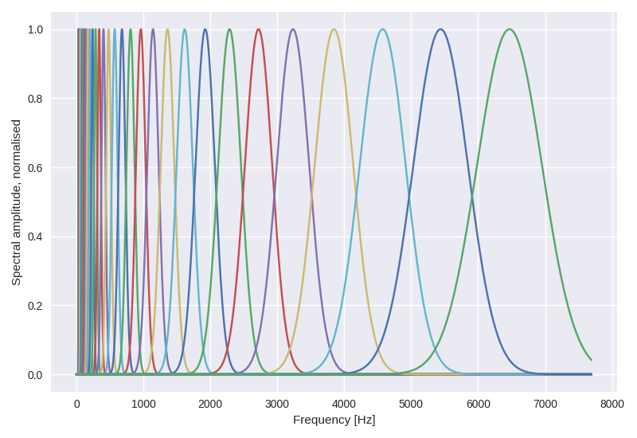
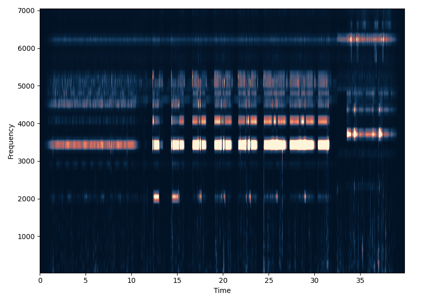

# MorletX

***A lightweight, high-performance Python library for continuous wavelet transform (CWT) using Morlet wavelet filter bank, with GPU computing support.***

[](https://github.com/astral-sh/uv)
[](https://github.com/astral-sh/ruff)
[](https://pre-commit.com/)
[](https://python.org/)

**❗ Note this project is still in early development.**

## Overview

This Python library provides an implementation of the Morlet wavelet transform, a powerful time-frequency analysis method that offers an intuitive approach to understanding signal characteristics. The implementation is inspired by the pioneering work of [French geophysicist Jean Morlet](https://en.wikipedia.org/wiki/Jean_Morlet), leveraging his original, highly intuitive formulation which laid the foundation for the Continuous Wavelet Transform (CWT).

Unlike more abstract modern formulations of the CWT, Jean Morlet's method is deeply rooted in physical intuition, making it particularly accessible for comprehending how signals vary in frequency over time.

## Features

- **Intuitive Implementation**: Directly implements Morlet's original and physically intuitive formulation of the wavelet transform, as detailed in his 1982 papers.
- **High Performance**: Supports computations on both the CPU and GPU, enabling efficient processing of large datasets and high-frequency signals.
- **Pythonic Design**: Developed as a user-friendly Python library, making it accessible for researchers and developers.

## Installation

If you use `uv` as your Python package manager, you can install MorletX using the following command:

```bash
# Install as a Git dependency source using `uv` (recommended)
$ uv add git+https://github.com/nimanzik/MorletX
```

If you prefer to use `pip`, you need to install it from source:

```bash
# Install from source using `pip`
$ git clone https://github.com/nimanzik/MorletX.git
$ cd MorletX
$ pip install .
```

## Examples

To compute the scaleogram (the output of the CWT):

```python
import numpy as np

from morletx.core import MorletFilterBank

data = ... # some signal data
fs = ... # sampling frequency of the signal


filter_bank = MorletFilterBank(
    n_octaves=8,
    n_intervals=8,
    shape_ratio=5,
    duration=2.0,
    sampling_freq=fs,
    array_engine="numpy",
)

scaleogram = filter_bank.transform(data, mode="power")
```

You can also use the GPU to compute the scaleogram by setting the `array_engine="cupy"` parameter.

To visualise the scaleogram:

```python
import matplotlib.pyplot as plt

fig = filter_bank.plot_scalogram_mpl(data)
plt.show()
```

Here is an example of the computed scaleogram for a signal with a sampling frequency of 16 kHz:

<div align="center">
<table>
<tr>
<td align="center">
<strong>Example Signal</strong><br>

</td>
<td align="center">
<strong>Morlet Filter Bank</strong><br>

</td>
<td align="center">
<strong>Computed Scaleogram</strong><br>

</td>
</tr>
</table>
</div>

## Troubleshooting

Report any issues or bugs on [GitHub Issues](https://github.com/nimanzik/MorletX/issues).

## Contact

- Nima Nooshiri – [nima.nooshiri@gmail.com](mailto:nima.nooshiri@gmail.com)
